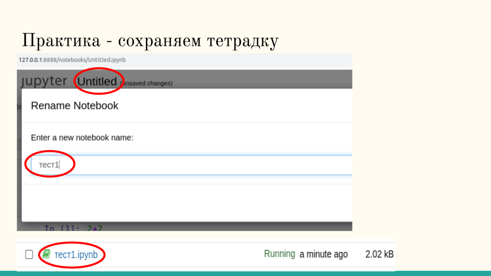

# Занятие 1


## Демонстрации


[@sber_rudalle_xl_bot](http://t.me/sber_rudalle_xl_bot)

[AI да Пушкин](https://ai-pushkin.content.tinkoff.ru/)

[Балабоба - сервис недоступен с марта](https://yandex.ru/lab/yalm)

## Работа с Jupyter

## Скачать miniconda

https://conda.io/en/latest/miniconda.html

Я установил 64-битную версию с питоном 3.7 для совместимости. Новый питон (3.8, 3.9) легко установить.


### Запустить консоль и установить требуемые пакеты

```bash
$ conda install notebook nb_conda_kernels git
```

### Запуск Jupyter

В меню системы выберите Все Программы->Anaconda->Jupyter Notebook

Появляется окно с запуском команды и вкладка в браузере. Для остановки интерпретатора питона надо остановить процесс в окне командой Ctrl-C, потом закрыть вкладку в браузере.

### Простые задания в "тетрадке"

В правом внрхнем углу найдите New и выберите Python 3.


Напишите одну или несколько строчек в ячейке и нажмите Ctrl-Enter или кнопку Run. Для новой ячейки нажмите кнопку +.


Пример: 

```python
2+2
```

```python
a = ["apples", "oranges"]
print(f"You are mixing {a[0]} and {a[1]} here!")
```

Переименуйте ноутбук:



### Запуск тетрадки с примерами FaceLib 

В окне Anaconda Prompt 

Скачайте (склонируйте) репозиторий с кодом FaceLib

```bash
git clone https://github.com/datamove/FaceLib.git
```

cоздайте среду питона для запуска FaceLib

```bash
$ conda create -n faceenv ipykernel git
```

Установите требуемые пакеты:

```bash
conda activate faceenv
pip install -r FaceLib\requirements.txt
```

Во вкладке с каталогом найдите FaceLib, азйдите в нее и кликните на `examples.ipynb` 

Смените среду питона на `faceenv`.


Запускайте ячеки по одной.

TODO BSOD из-за драйвера камеры

## Работа с Colab

TODO Malevich XL

## Домашнее задание

* Запустите модель Малевич на вашем лаптопе/ПК (в режиме ЦПУ). Для этого создайте новую среду питона, установите требуемые пакеты из файла requrements.txt, смените движок с `cuda` на `cpu`. Поделитесь картинками в группе.
* Посмотрите [репозиторий Сбербанка](https://github.com/ai-forever), что еще вы хотите запустить? Может быть [сгенерировать эмотиконки](https://github.com/ai-forever/ru-dalle/blob/master/Emojich.md)?
