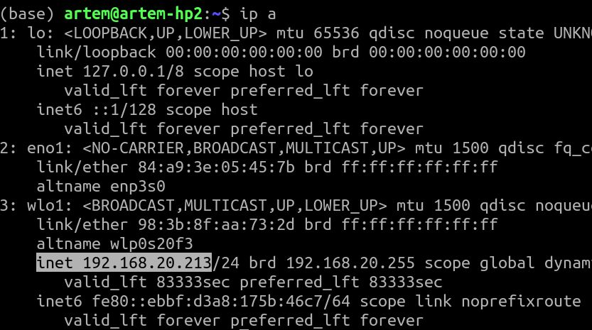

# Raspberry pi

## Запись образа

## Конфигурация

## Определение ip-адреса малинки в сети.

Откройте терминал и напечатайте `ip a`:




## Удаленный доступ на ваш микрокомпьютер

### Установка демона ssh

```bash
sudo apt install openssh-server
```

### Проверка логина

```bash
ssh kod@localhost
```

введите ваш пароль и если нет ошибки, вы должны увидеть ту же самую оболочку :)

### Логин на сайт

Переключите дисплей назад на лаптоп, и откройте терминал Windows. в нем напишите 

`ssh kod@ваш ip адрес`

Введите пароль и вы должны попасть на вашу малинку!

## Задания

### Сигнальный бот телеграмм 

Давайте сделаем бота телеграмм, который будет присылать IP-адрес малинки, при подключении к сети

#### Заводим бота в телеграмм

#### Отправляем сообщение боту через API

#### Берем адрес из вывода команды ip a

#### Пишем скрипт на bash

`nano myip.sh`

`chmod +x myip.sh`

#### Конфигурируем запуск скрипта

`crontab -e`


`@reboot /home/kod/my >/home/kod/ip.log 2>&1`

Перегружаем малинку и ждем сообщения в боте!

`sudo reboot`

### Малинка-шпион

Делаем снимки на камеру малинки и отсылаем их в бот.

#### Подключение и конфигурация камеры

#### снимок с камеры 

#### скрипт

#### запуск скрипта по расписанию


